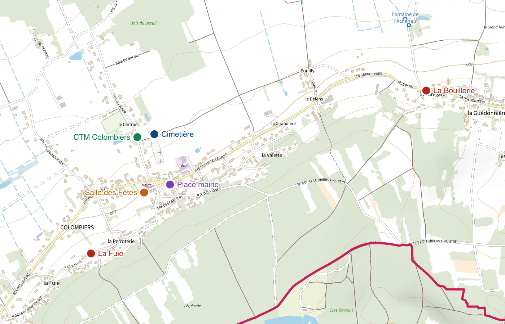

# Des cartes détaillées de votre commune, prêtes à imprimer

**cartes** assemble le plan IGN ou les photographies aériennes sur le territoire d'une commune française, y ajoute ses propres données et la mention des sources, et produit une image prête pour l'imprimeur — de l'A3 posé sur une table à l'affiche de la salle du conseil. Libre et gratuit.

## Quatre façons de s'en servir

Toutes produisent exactement la même carte : elles partagent le même code de génération.

- **[Page web](https://sebprunier.github.io/cartes/generer/)** — Rien à installer : un navigateur suffit. Pour la plupart des cartes, jusqu'au format A0.
- **[Application de bureau](application-de-bureau.md)** — Pour les très grandes cartes, que le navigateur ne sait pas dessiner, et le format TIFF des imprimeurs. Sur Windows, macOS et Linux.
- **[Ligne de commande](ligne-de-commande.md)** — Pour répéter, automatiser, ou produire les cartes de plusieurs communes d'un coup.
- **[API](api.md)** — Pour intégrer cartes à un autre logiciel : un serveur que chacun héberge où il veut.

## Ce que l'outil fait pour vous

- **Lisible une fois imprimée** — Le zoom se choisit d'après le format papier, et l'aperçu montre les étiquettes à l'échelle réelle avant de lancer la génération.
- **Des données publiques** — Plan IGN, photographies aériennes, cadastre, risques naturels et technologiques : IGN, Géorisques et BRGM, sous licence ouverte.
- **Les licences respectées** — La mention des sources et la date de mise à jour de chaque donnée sont écrites sur la carte, comme la licence l'exige.
- **Vos propres données** — Un fichier GeoJSON ou CSV, avec ses catégories, ses couleurs, ses étiquettes et une légende.
- **Rien ne sort de chez vous** — Aucun compte, aucun envoi : la carte est dessinée sur votre ordinateur, à partir des services publics de données.
- **Libre** — Le code est ouvert, sous licence MIT, et chacun peut le relire, l'améliorer ou l'héberger.

## Par où commencer

- **[Prise en main](prise-en-main.md)** — Une première carte en cinq minutes.
- **[Zoom et impression](zoom-et-impression.md)** — La question qui décide de tout le reste : pourquoi le zoom maximal n'est pas le bon choix.
- **[Ajouter des données](donnees.md)** — Les couches publiques à superposer, et les fichiers de la commune.
- **[Problèmes courants](problemes-courants.md)** — Un message d'erreur, une couche absente, une carte trop lourde.
