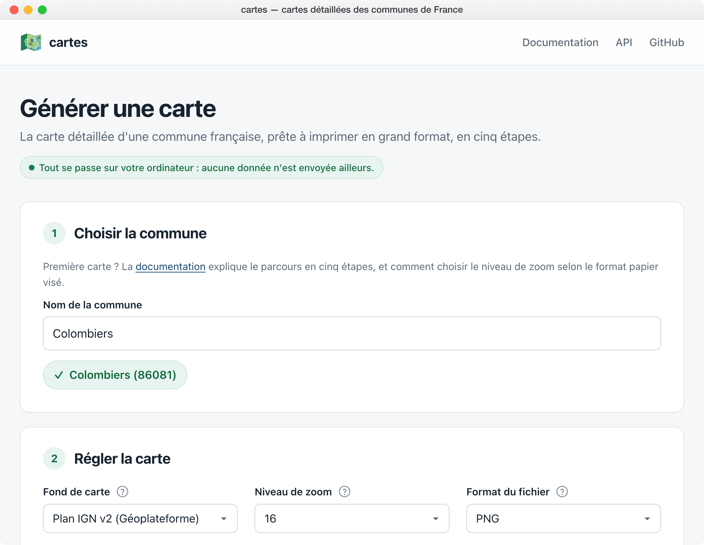
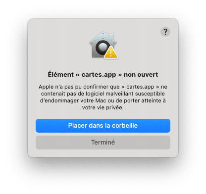
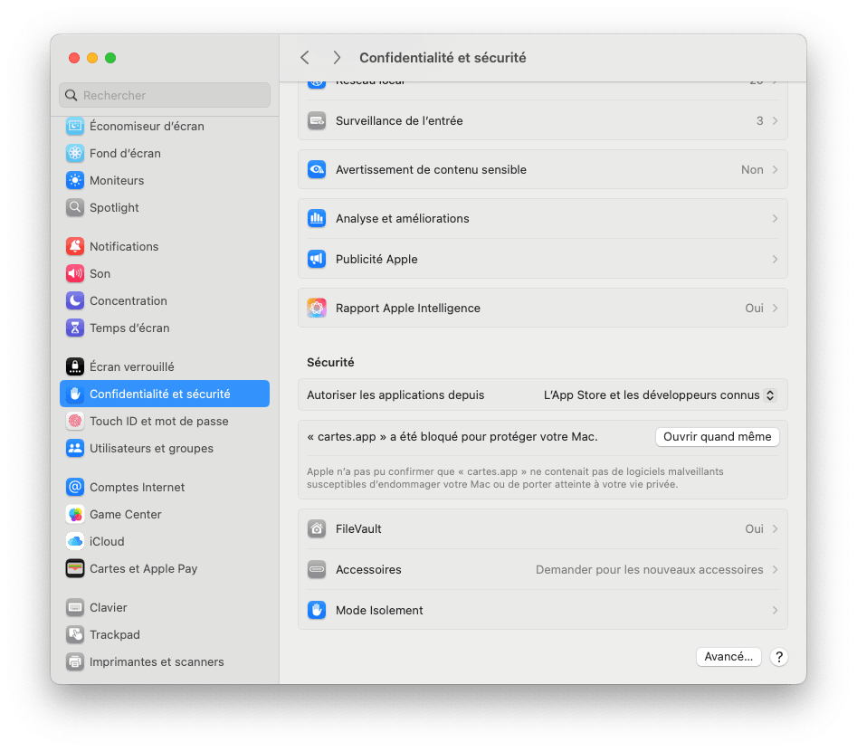
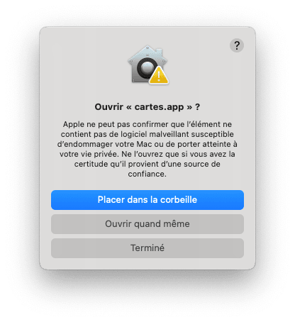
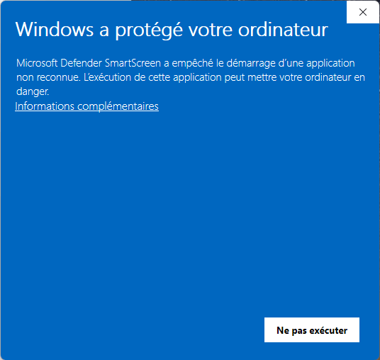
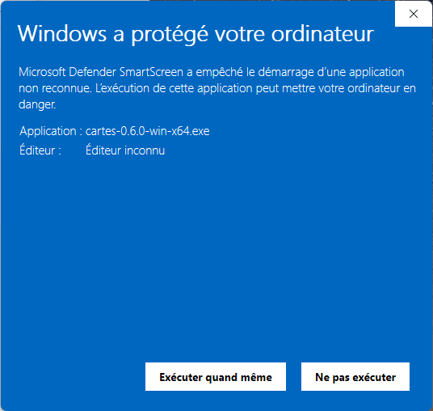

# Application de bureau

L'application reprend l'interface de la page web, mais génère les cartes avec le même moteur que la ligne de commande. Elle sert quand le navigateur ne suffit plus.



## Ce qu'elle apporte

- **Les zooms 18 et 19**, que le navigateur refuse de dessiner sur une commune de taille moyenne.
- **Le format TIFF**, que certains imprimeurs demandent.
- **Un cache des tuiles sur disque** : regénérer la même commune ne retélécharge rien.
- **Un PNG plus léger** : les plans sont écrits avec une palette de 256 couleurs, ce que le navigateur ne sait pas faire.
- **L'enregistrement direct** dans le fichier de votre choix, sans passer par le dossier de téléchargements.

## Installer

Les installeurs pour **macOS (Apple Silicon)**, **Windows** et **Linux** sont joints à chaque [version publiée](https://github.com/sebprunier/cartes/releases). Sur un Mac à processeur Intel, utilisez pour l'instant la page web ou la ligne de commande.

## Au premier lancement, votre système va se méfier

Les applications ne sont pas signées, faute de certificat : signer coûte environ 99 $ par an chez Apple, et un certificat payant chez Windows. Votre système affiche donc un avertissement, et il a raison de le faire — voici comment passer outre en connaissance de cause.

### macOS

Ouvrez le fichier `.dmg` téléchargé, et glissez l'application dans le dossier Applications. Puis :

1. **Double-cliquez sur l'application.** macOS refuse de l'ouvrir : cliquez sur « Terminé », surtout pas sur « Placer dans la corbeille ».

   

2. **Ouvrez Réglages système, puis Confidentialité et sécurité**, et descendez jusqu'à la section Sécurité. Une ligne y annonce que « cartes.app » a été bloqué : cliquez sur « Ouvrir quand même ». Cette ligne n'apparaît qu'après la tentative d'ouverture de l'étape 1, et disparaît au bout d'une heure environ : si vous ne la voyez pas, recommencez l'étape 1.

   

3. **Confirmez** en cliquant sur « Ouvrir quand même » dans le dialogue qui suit.

   

4. **Autorisez** avec Touch ID ou le mot de passe de votre session.

   

L'application s'ouvre, et s'ouvrira désormais d'un simple double-clic. Sur les versions de macOS antérieures à Sequoia (macOS 15), un clic droit sur l'application, puis « Ouvrir », suffit.

Si vous êtes à l'aise avec le Terminal, une commande remplace ces quatre étapes : `xattr -dr com.apple.quarantine /Applications/cartes.app`.

### Windows

Lancez l'installeur `.exe` téléchargé. SmartScreen affiche « Windows a protégé votre ordinateur » :

1. **Cliquez sur « Informations complémentaires »**, sous le texte de l'avertissement.

   

2. **Cliquez sur « Exécuter quand même »**, qui apparaît alors avec le nom de l'application.

   

Sur un poste géré par un service informatique, ce bouton peut manquer : l'installation se demande alors à ce service, ou la page web prend le relais.

### Linux

Rendez le fichier exécutable avec `chmod +x cartes-*.AppImage`, puis lancez-le.

Si cette manipulation vous gêne — et elle a de bonnes raisons de gêner —, la [page web](https://sebprunier.github.io/cartes/generer/) ne demande aucune installation et fait la même chose jusqu'au zoom 17.

## Depuis les sources

```sh
git clone https://github.com/sebprunier/cartes.git
cd cartes
npm install
npm run electron
```
