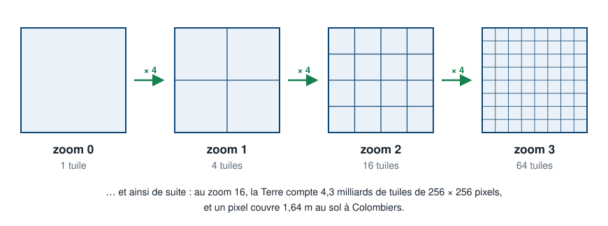
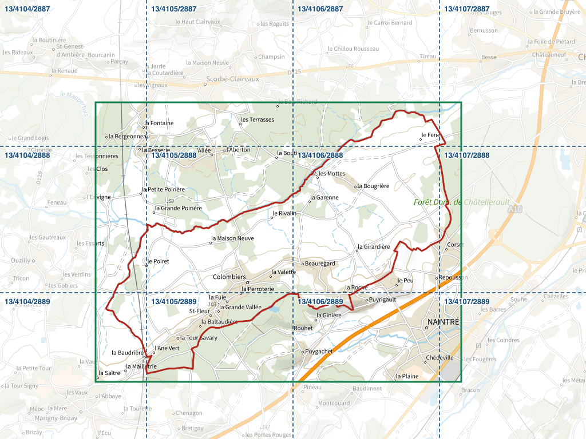
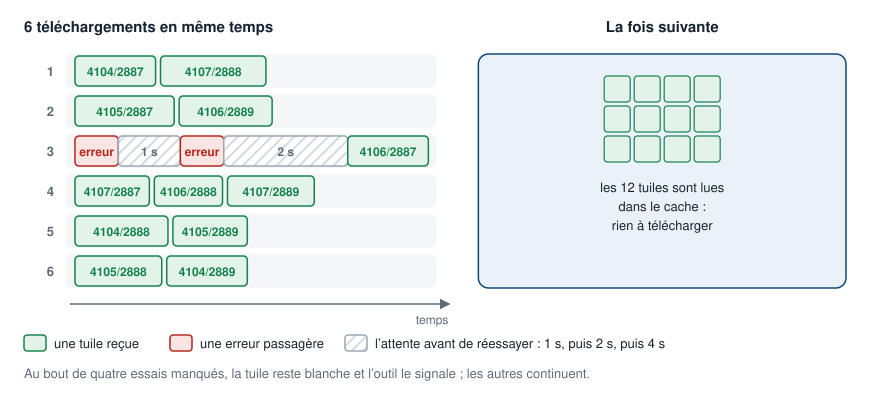
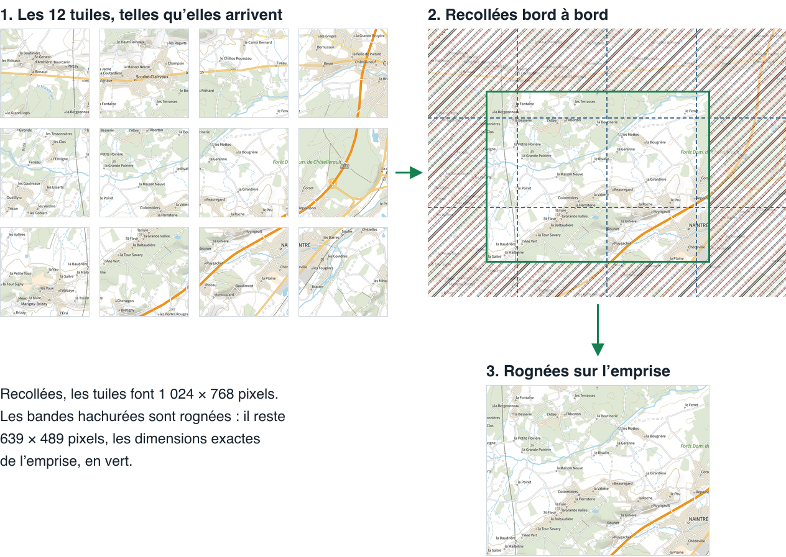
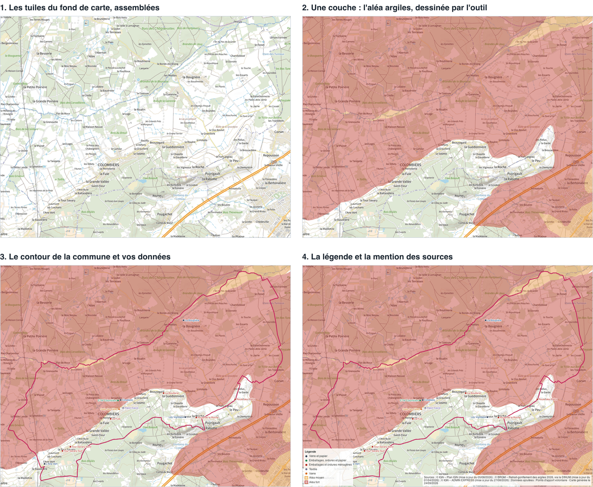
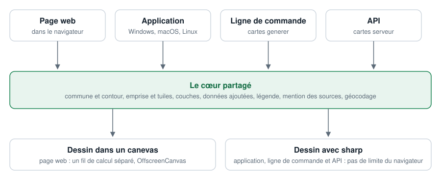
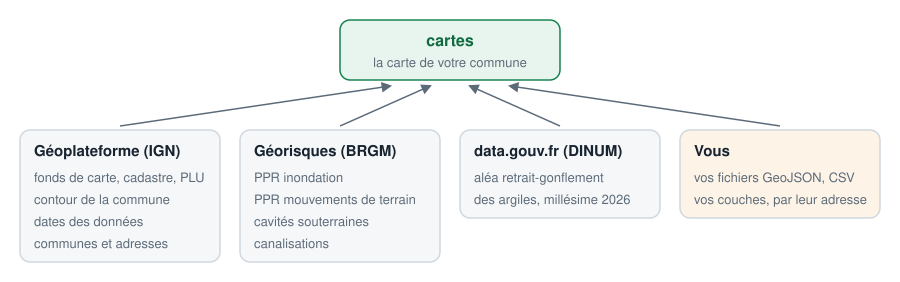

# Comment ça marche

Ce qui se passe entre le nom d'une commune et l'image prête à imprimer : les tuiles, le zoom, l'assemblage, les calques. Rien de tout cela n'est nécessaire pour faire une carte, mais tout cela aide à comprendre ce que l'outil propose, et pourquoi.

Les illustrations de cette page sont de vraies cartes de Colombiers, dessinées par l'outil lui-même.

## Des tuiles, niveau par niveau

Les fonds de carte ne sont pas une seule grande image : ce sont des **tuiles**, des carrés de 256 × 256 pixels, que les services publient pour chaque **niveau de zoom**. Au zoom 0, la Terre entière tient dans une tuile ; à chaque niveau, chaque tuile est découpée en quatre.

Monter d'un niveau double donc le détail : un pixel couvre deux fois moins de terrain. À Colombiers, un pixel couvre 13 m au sol au zoom 13, 1,64 m au zoom 16, 82 cm au zoom 17. Le texte des tuiles, lui, garde la même taille à tous les niveaux : c'est ce qui fait choisir le zoom d'après le format papier, comme l'explique [Zoom et impression](zoom-et-impression.md).

## De la commune aux tuiles

1. **La commune** est retrouvée par son nom ou son code INSEE, auprès du service de géocodage de la Géoplateforme.
2. **Son contour** vient d'ADMIN EXPRESS, la base des limites administratives de l'IGN.
3. **L'emprise** est le rectangle qui contient ce contour, élargi d'une marge de 3 % pour que la commune ne touche pas le bord.
4. **Les tuiles** à télécharger sont celles qui recouvrent l'emprise, au zoom demandé : 12 pour Colombiers au zoom 13, 336 au zoom 16, 1 271 au zoom 17.

Chaque tuile est désignée par trois nombres : son zoom, sa colonne et sa rangée — 13/4105/2888 ci-dessus.

## Le téléchargement

Les tuiles sont demandées six à la fois, pour aller vite sans surcharger un service public : dès qu'un téléchargement se termine, le suivant commence.

Un service comme la Géoplateforme refuse parfois une tuile qui existe, quand il est surchargé. L'outil la redemande alors, jusqu'à quatre essais en tout, en attendant deux fois plus longtemps avant chaque nouvel essai, pendant que les autres tuiles continuent d'arriver. Si les quatre essais échouent, la tuile reste blanche et l'outil le signale.

Dans l'application et en ligne de commande, les tuiles téléchargées sont gardées sur le disque : régénérer la même commune ne retélécharge rien. Sur la page web, c'est le cache du navigateur qui s'en charge.

## L'assemblage

Les tuiles sont recollées bord à bord, dans l'ordre de leurs colonnes et de leurs rangées. L'image obtenue déborde de l'emprise, puisque les tuiles du bord n'y entrent qu'en partie. Elle est donc rognée au pixel près : pour Colombiers au zoom 13, il reste 639 × 489 pixels sur 1 024 × 768.

## Les calques

Sur ce fond, l'outil pose ensuite ses calques, du dessous vers le dessus :

1. **Le fond de carte**, assemblé à partir des tuiles.
2. **Les couches** que vous avez choisies. Certaines sont servies comme des images : le cadastre en tuiles, les plans de prévention des risques demandés à Géorisques en quelques grandes images. D'autres sont dessinées par l'outil à partir de données vectorielles, comme l'aléa retrait-gonflement des argiles, et restent nettes à tous les niveaux de zoom.
3. **Le contour de la commune et vos données**, avec leurs étiquettes, placées pour ne pas se recouvrir.
4. **La légende**, en bas à gauche, et **la mention des sources**, en bas à droite, avec la date de chaque donnée.

Le contour, les données, la légende et la mention des sources sont écrits à la taille de l'image, pour rester lisibles une fois la carte imprimée : ils grandissent avec le zoom, là où le texte des tuiles ne change pas.

## Du pixel au papier

Une image n'a pas de taille sur le papier : elle a des pixels. C'est la **résolution d'impression**, en points par pouce (dpi), qui fait le lien :

> taille imprimée = nombre de pixels ÷ dpi × 2,54 cm

Colombiers au zoom 16 mesure 5 104 × 3 904 pixels. À 150 dpi, la valeur par défaut, cela fait 86 × 66 cm — un A0. À 300 dpi, deux fois moins : 43 × 33 cm. La valeur est écrite dans le fichier, et les logiciels d'impression la respectent.

## La mémoire, et les limites

Une image se dessine en mémoire : 3 octets par pixel, un par couleur. Colombiers au zoom 17 — 10 207 × 7 807 pixels — demande ainsi 239 Mo pour l'image seule, et la génération en occupe environ quatre fois plus, le temps de décoder les tuiles et de dessiner les calques.

- **La page web** dessine dans un canevas du navigateur, qui a une taille maximale : environ 268 millions de pixels sur Chrome. Avant de télécharger quoi que ce soit, la page essaie de dessiner un pixel dans le coin de l'image demandée : si le navigateur refuse, elle le dit, et renvoie vers l'application ou la ligne de commande.
- **L'application, la ligne de commande et l'API** dessinent avec la bibliothèque sharp, sans limite de taille — seulement celle de la mémoire de l'ordinateur. Les calques y sont dessinés par blocs de 4 096 pixels : la bibliothèque qui les trace refuse les images de plus de 32 767 pixels de côté.

## Un seul moteur, quatre outils

La page web, l'application, la ligne de commande et l'API partagent le même code pour tout ce qui décide du contenu de la carte. Elles ne diffèrent que par la façon de dessiner, et par ce qu'elles savent faire : la même commande, au même zoom, donne la même carte partout.

## D'où viennent les données

Toutes sont publiques, sous licence ouverte, et citées sur chaque carte. La page [Sources et licences](donnees-et-licences.md) les détaille une à une, avec ce que leur licence permet et ce qu'elle impose.

## Glossaire

- **Code INSEE** : le code à cinq caractères qui désigne une commune — 86081 pour Colombiers. Contrairement au nom, il est unique.
- **Dpi** : points par pouce, la densité à laquelle une image s'imprime. 150 dpi pour une affiche regardée à un mètre, 300 pour un document tenu en main.
- **Emprise** : le rectangle couvert par la carte, celui du contour de la commune élargi d'une marge.
- **Géocodage** : retrouver la position d'une adresse. L'outil s'appuie sur la Base Adresse Nationale ; voir [Ajouter des données](donnees.md).
- **Tuile** : un carré de 256 × 256 pixels d'un fond de carte, à un niveau de zoom donné.
- **Tuiles vectorielles** : des tuiles qui portent des formes et non des pixels ; l'outil les dessine lui-même, nettes à tous les zooms.
- **WMS**, **WMTS** : les deux normes par lesquelles les services publient leurs images — à la demande pour le premier, en tuiles pour le second.
- **Zoom** : le niveau de détail. Chaque niveau double le détail, et multiplie par quatre le nombre de tuiles, donc la taille de l'image.
