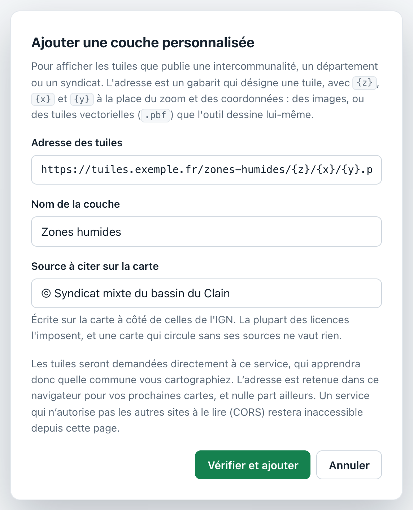
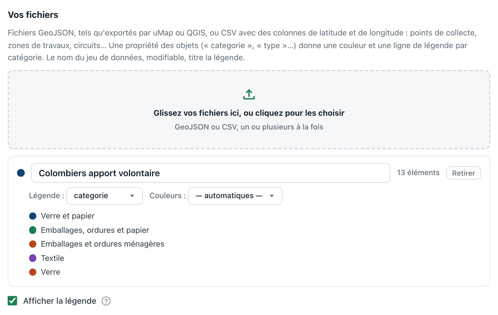
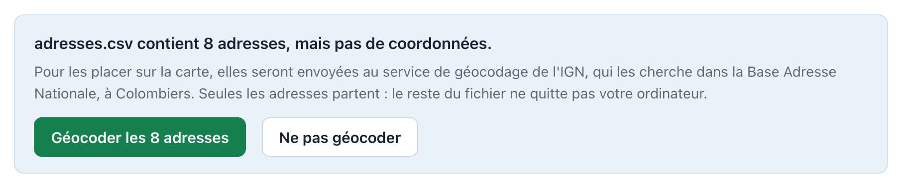
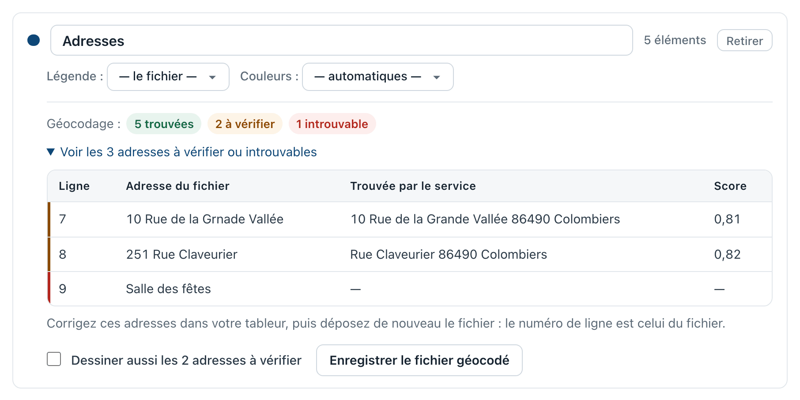

# Ajouter des données

Deux façons d'ajouter des informations sur une carte, qui se combinent : choisir des **données publiques** déjà en ligne, dans un catalogue, ou fournir **vos propres fichiers**.

Dans les deux cas, ce que vous ajoutez est cité dans la mention des sources en bas de la carte : personne ne pourra croire que ces données viennent de l'IGN.

## Données publiques

Elles ne demandent aucun fichier : elles sont téléchargées au moment de la génération. Dans l'interface, le bouton « Ajouter une couche » ouvre le catalogue, rangé par thème. Chaque couche y indique qui la publie et, s'il le faut, le zoom à partir duquel elle se dessine : le badge passe en orange quand le zoom choisi est trop petit. En ligne de commande, `cartes couches` en donne la liste.

| Thème | Couche | Ce qu'elle montre |
| --- | --- | --- |
| Foncier et urbanisme | Parcelles cadastrales | limites et numéros des parcelles, à partir du zoom 16 |
| Risques | PPR inondation | zonage réglementaire des plans de prévention du risque inondation |
| Risques | PPR mouvements de terrain | zonage réglementaire, pour les glissements et effondrements |
| Risques | Cavités souterraines | carrières, caves et ouvrages souterrains abandonnés |
| Risques | Canalisations de matières dangereuses | gaz, hydrocarbures et produits chimiques |
| Risques | Retrait-gonflement des argiles | aléa faible, moyen ou fort, millésime 2026 |

Chaque couche a une **opacité** réglable, pour laisser lire le fond de carte en dessous. Certaines ne sont dessinées qu'à partir d'un certain zoom : l'outil le signale avant de télécharger quoi que ce soit.

Une couche vide n'est pas une panne : beaucoup de communes ne sont traversées par aucune canalisation, et n'ont ni cavité recensée ni plan de prévention.

### Ajouter sa propre couche

Le catalogue ne couvre pas tout. Une communauté de communes, un département, un syndicat d'eau publient souvent leurs propres tuiles : le bouton « Ajouter une couche personnalisée », dans le catalogue, permet de les afficher par l'adresse de leurs tuiles. En ligne de commande, c'est `--couche-perso`.

Trois choses sont demandées :

- **l'adresse des tuiles**, sous forme de gabarit : `https://exemple.fr/tuiles/{z}/{x}/{y}.png`, où `{z}`, `{x}` et `{y}` sont remplacés par le zoom et les coordonnées de chaque tuile. Des images (`.png`, `.jpg`) ou des tuiles vectorielles (`.pbf`), que l'outil dessine alors lui-même à partir des couleurs et des libellés que les tuiles portent ;
- **le nom** de la couche, tel qu'il apparaîtra dans l'interface et dans la légende ;
- **la source à citer**, obligatoire : elle est écrite sur la carte à côté de celles de l'IGN. La plupart des licences l'imposent, et vous restez responsable des droits sur ce que vous affichez.

L'adresse est essayée sur une tuile avant d'être acceptée. Si le service ne connaît aucune des tuiles demandées, c'est presque toujours que l'adresse est inexacte ; s'il répond sans rien donner, la couche ne couvre peut-être simplement pas votre commune. Dans les deux cas l'outil le dit, et vous laisse ajouter la couche quand même.

Les adresses saisies sont retenues pour vos prochaines cartes — dans votre navigateur, ou sur votre ordinateur pour l'application — et le catalogue les propose ensuite sous « Vos couches », avec de quoi les oublier.

#### Ce qu'il faut savoir

- **Le service voit passer vos requêtes** et apprend quelle commune vous cartographiez. C'est la seule chose qui sort de votre navigateur.
- **Depuis la page web**, un service qui n'autorise pas les autres sites à le lire (ce qu'on appelle CORS) reste inaccessible. La ligne de commande et l'application de bureau n'ont pas cette limite.
- **Ménagez les services que vous ne payez pas** : un zoom élevé, c'est des milliers de tuiles. Certains limitent le nombre de requêtes et l'outil s'arrête alors en vous conseillant de baisser le zoom.
- **Une couche vectorielle ne dit pas où s'arrête sa donnée.** L'outil cherche le niveau de détail qu'elle contient vraiment ; au-delà, les mêmes contours sont dessinés en plus grand, nets mais pas plus précis.

## Vos fichiers

Glissez un fichier dans la zone prévue, ou utilisez `--donnees` en ligne de commande.

### Formats acceptés

- **GeoJSON**, tel qu'exporté par uMap, QGIS ou geojson.io : points, lignes, polygones.
- **CSV** avec une colonne de latitude et une de longitude. Les noms usuels sont reconnus (`latitude`, `lat`, `y` ; `longitude`, `lon`, `lng`, `x`), le point-virgule comme séparateur et la virgule décimale aussi — donc ce que produit un tableur français, y compris dans l'encodage Windows d'Excel.
- **CSV d'adresses**, sans coordonnées : l'outil propose alors de les géocoder, comme l'explique la section suivante.

Les coordonnées doivent être en longitude/latitude (WGS 84). Un fichier projeté, par exemple en Lambert 93, est refusé avec un message qui l'explique plutôt que d'être dessiné n'importe où.

### Un fichier d'adresses

C'est souvent ce qu'une mairie a sous la main : une liste de défibrillateurs, de commerces ou de logements communaux, avec leur adresse, mais pas leurs coordonnées. L'outil sait les placer, en les **géocodant**.

Il reconnaît une colonne `adresse`, ou des colonnes séparées `numéro`, `voie`, `code postal` et `commune`, qu'il assemble. Au dépôt d'un tel fichier, il dit combien d'adresses il contient, et demande la permission avant d'envoyer quoi que ce soit.

Les adresses — et elles seules, le reste du fichier ne quitte pas votre ordinateur — sont envoyées au service de géocodage de l'IGN, qui les cherche dans la **Base Adresse Nationale**, en restreignant la recherche à la commune de la carte. Sans cette restriction, une adresse écrite sans sa commune tombait près d'une fois sur deux sur une voie du même nom ailleurs en France.

Chaque adresse est ensuite classée :

- **trouvée** : placée avec assurance, et dessinée sur la carte ;
- **à vérifier** : le service a hésité, ou n'a trouvé qu'une route ou une rue, sans numéro — parce que l'adresse n'en a pas, ou que la Base Adresse Nationale ne le connaît pas. Le point est alors au milieu de la voie, qui peut être loin du lieu voulu : sur une route de campagne, jusqu'à un kilomètre. Un lieu-dit ou une place, plus ramassés, sont trouvés. Ces adresses ne sont dessinées que si vous cochez « Dessiner aussi les adresses à vérifier » ;
- **introuvable** : rien de sûr, rien de dessiné. Un nom de lieu seul, comme « Mairie » ou « Salle des fêtes », n'est pas une adresse : le service ne le trouve pas.

Ce classement n'est pas un détail. Le service répond toujours quelque chose, même quand il se trompe, et une adresse placée au mauvais endroit a l'air juste : c'est pire qu'une adresse absente. Les seuils qui séparent les trois classements ont été mesurés sur 430 adresses de Colombiers, écrites comme une mairie les écrirait — fautes de frappe et abréviations comprises : aucune adresse mal placée n'y était classée trouvée.

Le tableau donne, pour chaque adresse à regarder, son numéro de ligne dans le fichier et ce que le service a trouvé. **Corrigez-les dans votre tableur**, puis déposez de nouveau le fichier : la correction servira à toutes vos cartes suivantes.

« Enregistrer le fichier géocodé » donne le même fichier, dans le même séparateur, complété de la latitude, de la longitude et du résultat de chaque ligne. Déposé plus tard, il est ajouté aussitôt, sans rien envoyer de nouveau. En ligne de commande, c'est [`cartes geocoder`](ligne-de-commande.md) qui fait ce travail.

Une carte qui dessine des adresses géocodées cite la Base Adresse Nationale, et la date du géocodage, dans sa mention des sources : sa licence le demande.

### Étiquettes, catégories et couleurs

- **L'étiquette** d'un objet vient d'une colonne ou d'une propriété `nom`, `name`, `libelle` ou `title`. Elle est écrite à côté du point, avec un contour blanc pour rester lisible sur un fond chargé.
- **Les catégories** viennent d'une propriété `categorie`, `category`, `type` ou `groupe`. Chaque catégorie reçoit sa couleur et sa ligne dans la légende, ce qui permet de tout garder dans un seul fichier — les points d'apport volontaire par type de déchet, par exemple.
- **Les couleurs** du fichier sont respectées quand il en porte (`marker-color`, `fill`… comme dans uMap), sinon une couleur est attribuée par catégorie.
- **Le nom du jeu de données** titre la légende et apparaît dans la mention des sources. Il vient du nom du fichier, et se modifie dans l'interface ou avec `--donnees-titre`.

### Ce qu'il faut savoir

Une étiquette qui en recouvrirait une autre est déplacée autour de son point, et abandonnée s'il n'y a pas la place : son point reste dessiné, et la légende suffit à le comprendre. Au-delà de 5 000 objets, l'outil prévient que beaucoup d'étiquettes ne seront pas écrites.

Vous êtes responsable des droits sur les fichiers que vous ajoutez. Les données produites par la commune ne posent en général pas de difficulté ; celles récupérées ailleurs sont à vérifier auprès de leur producteur.

## Exemples

Le dossier [`exemples/`](https://github.com/sebprunier/cartes/tree/main/exemples) contient les points d'apport volontaire de Colombiers, dans les deux formats acceptés. C'est un bon point de départ pour préparer son propre fichier. `colombiers-apport-volontaire-adresses.csv` est le même fichier sans ses coordonnées, pour essayer le géocodage : ses adresses sont écrites telles que Grand Châtellerault les publie.
