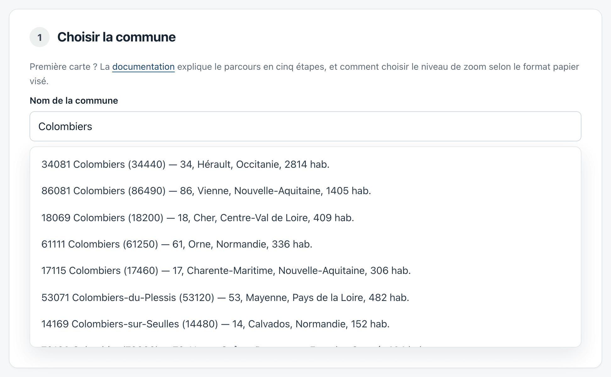
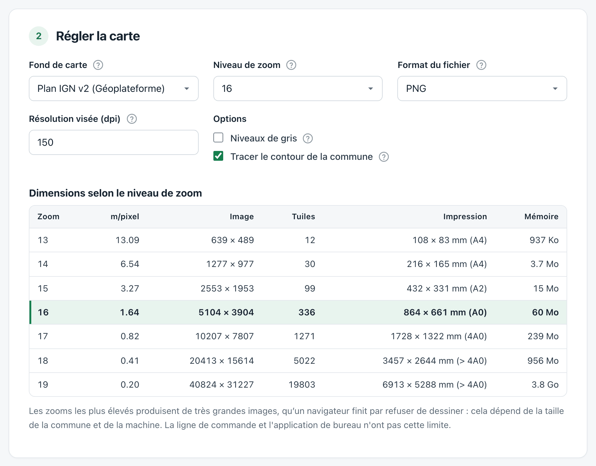
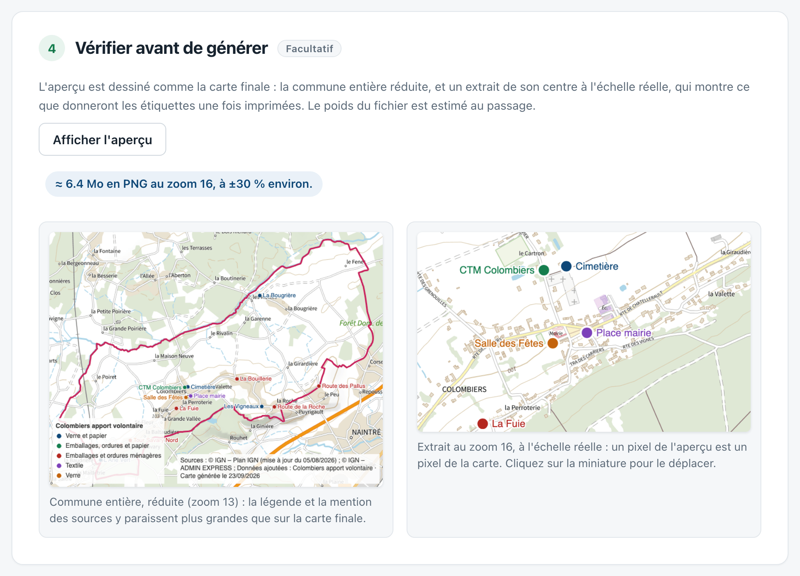
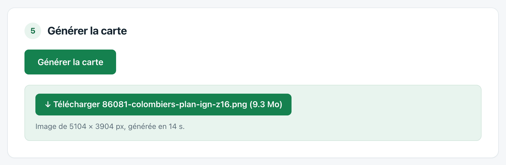

# Prise en main

**cartes** produit la carte détaillée d'une commune française, prête à imprimer en grand format : le plan IGN ou les photographies aériennes, recadrés sur le territoire de la commune, avec son contour, les données que vous ajoutez et la mention des sources.

L'outil est libre et gratuit. Les données viennent de services publics — IGN, Géorisques — et restent sous leur licence d'origine. Cette page suit la [page web](https://sebprunier.github.io/cartes/generer/), qui ne demande rien à installer ; l'[application de bureau](application-de-bureau.md) reprend exactement la même interface.

## Votre première carte, en cinq minutes

1. **Choisissez la commune.** Ouvrez la [page web](https://sebprunier.github.io/cartes/generer/) et saisissez le nom de votre commune. En cas d'homonymes, la liste indique le département et le nombre d'habitants.

   

2. **Réglez la carte** : le fond (plan ou photographies aériennes) et le niveau de zoom. Le tableau des dimensions indique, pour chaque zoom, la taille de l'image et le format papier correspondant. Commencez par le zoom déjà sélectionné.

   

3. **Ajoutez des données**, si vous le souhaitez : des couches publiques — cadastre, risques — ou vos propres fichiers. Cette étape est facultative ; la page [Ajouter des données](donnees.md) la détaille.

4. **Affichez l'aperçu.** Il montre la commune entière réduite, un extrait à l'échelle réelle, et le poids du fichier. C'est le moment de vérifier que les noms de rue seront lisibles une fois imprimés.

   

5. **Générez la carte**, puis téléchargez-la. Le téléchargement des tuiles prend de quelques secondes à quelques minutes selon la taille demandée ; l'avancement s'affiche source par source.

   

## Ce que vous obtenez

Une image — PNG ou JPEG, et TIFF dans l'application de bureau et en ligne de commande — qui porte :

- le **contour de la commune**, tracé d'après les limites officielles d'ADMIN EXPRESS ;
- les **données ajoutées**, avec leurs étiquettes et une **légende** en bas à gauche ;
- la **mention des sources** en bas à droite, avec la date de mise à jour de chaque donnée et la date de génération.

 au zoom 16 : 5 104 × 3 904 pixels, soit 86 × 66 cm à 150 dpi. Image réduite ici.")

Cette mention n'est pas décorative : la licence des données impose de citer la source et la fraîcheur de l'information. **Conservez-la si vous recadrez ou retouchez la carte.** Voir [Sources et licences](donnees-et-licences.md).

## Pour aller plus loin

- [Choisir le zoom et le format papier](zoom-et-impression.md) — la question qui décide de tout le reste
- [Ajouter des données](donnees.md) — couches publiques et fichiers de la commune
- [Application de bureau](application-de-bureau.md), [ligne de commande](ligne-de-commande.md) et [API](api.md) — quand la page web ne suffit plus
- [Problèmes courants](problemes-courants.md)
