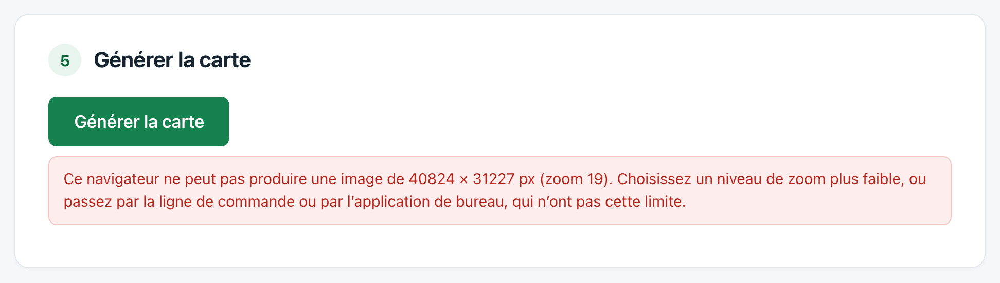

# Problèmes courants

## « Ce navigateur ne peut pas produire une image de … »

L'image demandée dépasse ce que le navigateur sait dessiner. Trois solutions, de la plus simple à la plus complète :

1. **Descendre d'un niveau de zoom.** Souvent suffisant, et sans conséquence si le format papier visé est petit.
2. **Utiliser l'[application de bureau](application-de-bureau.md)**, qui n'a pas cette limite.
3. **Passer par la [ligne de commande](ligne-de-commande.md)**, qui n'a pas cette limite non plus.

Le message apparaît avant tout téléchargement : rien n'a été consommé.

## Une couche cochée n'apparaît pas sur la carte

Trois causes possibles, dans l'ordre de fréquence :

- **La commune n'est pas concernée.** Beaucoup de communes n'ont ni canalisation de transport, ni cavité recensée, ni plan de prévention des risques. La couche est alors vide, et c'est une information en soi.
- **Le niveau de zoom ne convient pas.** Certaines couches ne sont dessinées qu'à partir d'un zoom : le cadastre ne montre les parcelles qu'à partir du zoom 16, les zonages de PPR ne s'affichent pas en dessous du zoom 13. L'interface le signale sous la couche concernée.
- **Le service est momentanément indisponible.** Relancez plus tard.

## Un fichier de données est refusé

- **« le fichier est probablement projeté, par exemple en Lambert 93 »** : vos coordonnées ne sont pas en longitude/latitude. Convertissez le fichier en WGS 84, ce que font QGIS et la plupart des outils d'export.
- **« Colonnes de coordonnées introuvables »** : votre CSV n'a pas de colonne reconnue comme latitude ou longitude. Renommez-les `latitude` et `longitude`.
- **« Fichier GeoJSON illisible »** : le fichier n'est pas du JSON valide, souvent parce qu'il a été tronqué à l'export.

## Des étiquettes manquent sur la carte

C'est voulu. Quand deux étiquettes se recouvrent, l'outil en déplace une, et l'abandonne s'il n'y a vraiment pas la place : deux textes l'un sur l'autre sont illisibles tous les deux. Le point, lui, reste dessiné.

Si beaucoup d'étiquettes manquent, c'est que les objets sont trop serrés pour le niveau de zoom : montez d'un zoom, ou découpez vos données.

## La carte est plus lourde que prévu

L'estimation est donnée à ±30 % environ, et elle repose sur un échantillon de tuiles. Une couche superposée ajoute son poids ; une carte en PNG depuis le navigateur pèse plus lourd que la même en ligne de commande, qui sait réduire la palette de couleurs.

Si le fichier est vraiment trop gros pour être envoyé par courriel, le format JPEG le divise par deux environ, au prix d'un léger flou sur le texte.

## Des tuiles manquent, laissées en blanc

Le service a refusé quelques tuiles, ce qui arrive. Relancez la même commande : les tuiles déjà téléchargées sont en cache, seules les manquantes seront redemandées.

## « Date de mise à jour des données indisponible »

Le catalogue de la Géoplateforme n'a pas répondu. La carte est correcte, mais sa mention des sources est incomplète au regard de la licence, qui demande la date de mise à jour. Regénérez plus tard.
